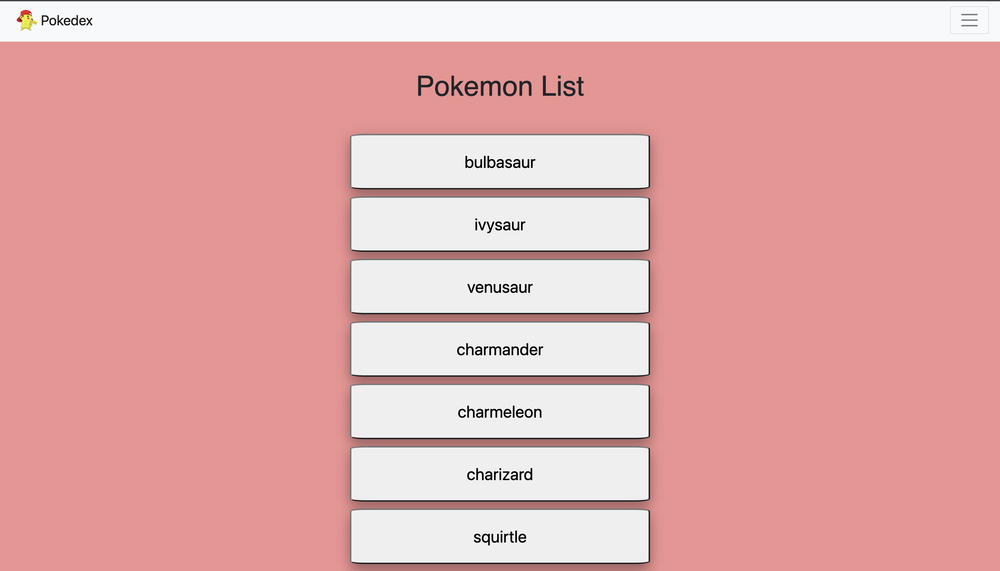
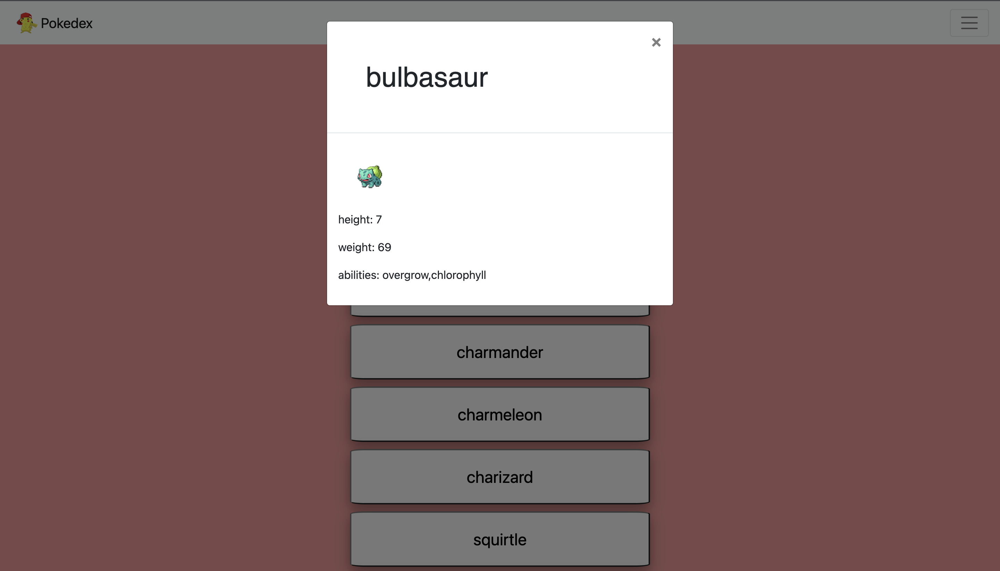

# Pokedex App

## Description

An application that displays a list of pokemon. Users can click on a given pokemon and a modal will appear with information and an image of the pokemon.

## Built With

- HTML, CSS, JavaScript
- Bootstrap
- jQuery

## Demo

https://johngibbs15.github.io/Pokedex-app/
